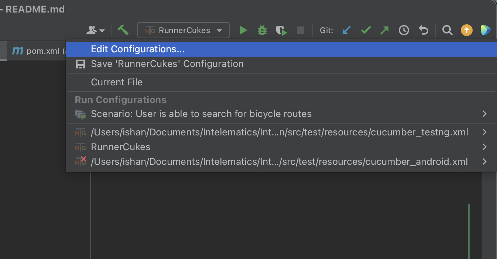
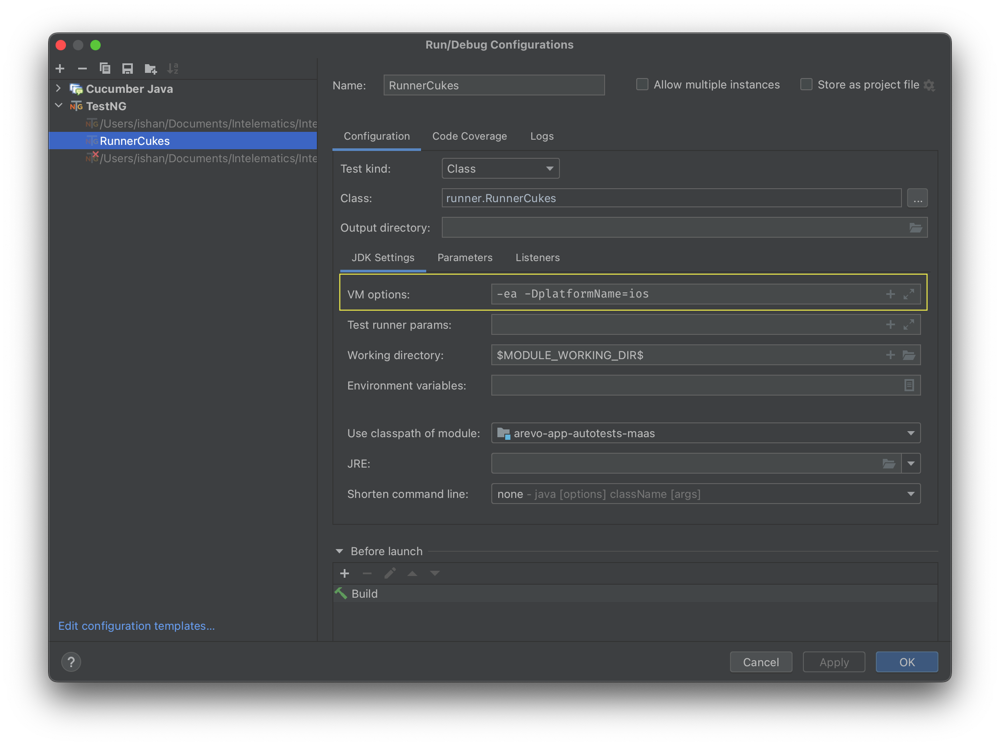

# Arevo automation
> Cross platform test automation suite for Arevo app.
---

### Setup & Installation (Prerequisites)
---
Please follow the setup documents published on confluence

* [Windows](https://intelehub.atlassian.net/l/cp/tuvHPbNB)
* [MacOS](https://intelehub.atlassian.net/l/cp/NPYAbgSS)

### Running tests   
#### IDE (IntelliJ)

* Ensure that the Cucumber and TestNG plugins are installed
* Under `Run > Edit configurations` select the run configuration and update the VM options: `-ea -DplatformName=ios/android` according to the platform you are running on.  
* Run the tests from the green play button or press `Ctrl + R`

#### CLI
* Navigate to the root of the project 
* android :robot: `mvn clean -Dtest=RunnerCukes -DplatformName=android test`
* apple :apple:  `mvn clean -Dtest=RunnerCukes -DplatformName=ios test`

